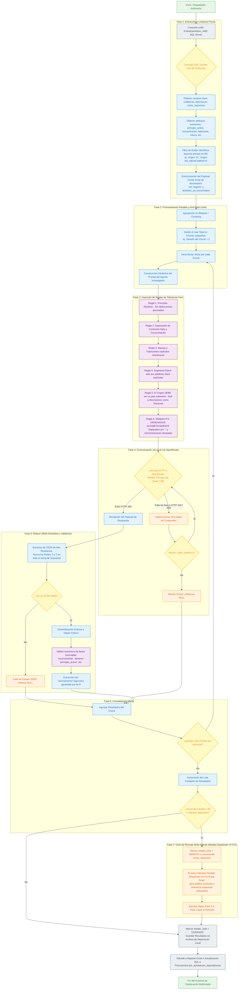

# Proceso Completo de Clasificación Farmacéutica

A continuación se detalla el diagrama de flujo exhaustivo (logorreico) que describe cada una de las fases, reglas de negocio y validaciones que ejecuta nuestro Agente Investigador Farmacéutico. Esta versión está optimizada, garantizada para renderizar en Mermaid Live Editor, y contiene la nueva **Fase 7 de Rescate Multi-Agente**.

```mermaid
%%{init: { "flowchart": { "htmlLabels": false } }}%%
flowchart TD
   A["Inicio: Orquestador Autónomo"] --> B["Conexión a BD EnterpriseAdmin_AMC SQL Server"]
  
   subgraph "Fase 1: Extracción y Limpieza Previa"
       B --> C{"Consulta SQL: Extraer Lote de Productos"}
       C --> D["Obtener campos clave: codbarras, descrip1art, ciclos_reproceso"]
       D --> E["Obtener atributos existentes: principio_activo, concentracion, fabricante, marca, etc."]
       E --> F["Filtro de Ruido: Identificar basuras previas en BD \n ej. 'origen: IA', 'origen: NO_MEDICAMENTO'"]
       F --> G["Estructuración del Payload Inicial: Array de diccionarios \n con 'registro' y 'atributos_ya_encontrados'"]
    end

   G --> H["Agrupación en Bloques / Chunking"]

   subgraph "Fase 2: Procesamiento Paralelo y Anti-Rate Limits"
       H --> I["Dividir el Lote Total en 'Chunks' pequeños \n ej. Tamaño del Chunk = 2"]
       I --> J["Inicio Bucle: Iterar por cada Chunk"]
       J --> K["Construcción Dinámica del Prompt del Agente Investigador"]
   end

   subgraph "Fase 3: Inyección de Reglas de Tolerancia Cero"
       K --> L["Regla 1: Precisión Absoluta - Sin deducciones alucinadas"]
       L --> M["Regla 2: Separación de Contenido Neto y Concentración"]
       M --> N["Regla 3: Marcas y Fabricantes explícitos únicamente"]
       N --> O["Regla 4: Segmento Etario solo por palabras clave explícitas"]
       O --> P["Regla 5: El Origen DEBE ser un país soberano - Null a descriptores como 'Nacional'"]
       P --> Q["Regla 6: Múltiples P.A. ORDENADOS ALFABÉTICAMENTE \n Separados por '-' y concentraciones alineadas"]
   end

   subgraph "Fase 4: Comunicación con la IA vía OpenRouter"
       Q --> R{"Llamada HTTP a OpenRouter \n Modelo Primario (Ej. Qwen 72B)"}
       R -- "Fallo de Red o HTTP 429 / 500" --> S["Espera Activa: time.sleep de 5 segundos"]
       S --> T{"Intento < Max_Retries 3?"}
       T -- "Sí" --> R
       T -- "No" --> U["Abortar Chunk y Retornar NULL"]
       R -- "Éxito HTTP 200" --> V["Recepción del Payload de Respuesta"]
   end

   subgraph "Fase 5: Robust JSON Extraction y Validación"
       V --> W["Extractor de JSON de Alta Resiliencia \n Busca los límites '[' y ']' en todo el string de respuesta"]
       W --> X{"¿Es un JSON Válido?"}
       X -- "No" --> Y["Fallo de Parseo JSON: Retorna NULL"]
       X -- "Sí" --> Z["Deserialización Exitosa a Objeto Python"]
       Z --> AA["Validar estructura de llaves retornadas \n 'razonamiento', 'dominio', 'principio_activo', etc."]
       AA --> AB["Extracción del 'razonamiento' logorreico generado por la IA"]
   end

   subgraph "Fase 6: Consolidación Inicial"
       Y --> AC["Agrupar Resultados del Chunk"]
       U --> AC
       AB --> AC
       AC --> AD{"¿Quedan más Chunks por procesar?"}
       AD -- "Sí" --> J
       AD -- "No" --> AE["Generación del Lote Completo de Resultados"]
       AE --> AF{"¿Score de Calidad < 88 \n o requiere reproceso?"}
   end

   subgraph "Fase 7: Ciclo de Rescate Multi-Agente (Modelo DeepSeek V4 Pro)"
       AF -- "Sí" --> AG["Marcar estado_ciclo = 'ABIERTO' e incrementar ciclos_reproceso"]
       AG --> AH["Enrutar a Modelo Pesado: DeepSeek V4 Pro (Fase Final) \n para análisis profundo e inferencia contextual exhaustiva"]
       AH --> AI["Ejecutar lógica Fase 2 a Fase 5 para el Rescate"]
   end

   AF -- "No" --> AJ["Marcar estado_ciclo = 'CERRADO' \n Guardar Resultados en Archivo de Depuración Local"]
   AI --> AJ
   AJ --> AK["Volcado a Reporte Excel o Actualización SQL a Procurement.por_aprobacion_equivalencias"]
   AK --> AL["Fin del Proceso de Clasificación Multimodal"]

    style A fill:#E8F5E9,stroke:#81C784,color:#2E7D32,stroke-width:2px
    style AL fill:#E8F5E9,stroke:#81C784,color:#2E7D32,stroke-width:2px
    style S fill:#FFF3E0,stroke:#FFB74D,color:#E65100,stroke-width:2px
    style U fill:#FFF3E0,stroke:#FFB74D,color:#E65100,stroke-width:2px
    style Y fill:#FFF3E0,stroke:#FFB74D,color:#E65100,stroke-width:2px
    style AG fill:#FFF3E0,stroke:#FFB74D,color:#E65100,stroke-width:2px
    style AH fill:#FFF3E0,stroke:#FFB74D,color:#E65100,stroke-width:2px
    style AI fill:#FFF3E0,stroke:#FFB74D,color:#E65100,stroke-width:2px
    style C fill:#FFF9C4,stroke:#FBC02D,color:#F57F17,stroke-width:2px
    style R fill:#FFF9C4,stroke:#FBC02D,color:#F57F17,stroke-width:2px
    style T fill:#FFF9C4,stroke:#FBC02D,color:#F57F17,stroke-width:2px
    style X fill:#FFF9C4,stroke:#FBC02D,color:#F57F17,stroke-width:2px
    style AD fill:#FFF9C4,stroke:#FBC02D,color:#F57F17,stroke-width:2px
    style AF fill:#FFF9C4,stroke:#FBC02D,color:#F57F17,stroke-width:2px
    style D fill:#E3F2FD,stroke:#64B5F6,color:#1565C0,stroke-width:2px
    style E fill:#E3F2FD,stroke:#64B5F6,color:#1565C0,stroke-width:2px
    style F fill:#E3F2FD,stroke:#64B5F6,color:#1565C0,stroke-width:2px
    style G fill:#E3F2FD,stroke:#64B5F6,color:#1565C0,stroke-width:2px
    style H fill:#E3F2FD,stroke:#64B5F6,color:#1565C0,stroke-width:2px
    style I fill:#E3F2FD,stroke:#64B5F6,color:#1565C0,stroke-width:2px
    style J fill:#E3F2FD,stroke:#64B5F6,color:#1565C0,stroke-width:2px
    style K fill:#E3F2FD,stroke:#64B5F6,color:#1565C0,stroke-width:2px
    style V fill:#E3F2FD,stroke:#64B5F6,color:#1565C0,stroke-width:2px
    style W fill:#E3F2FD,stroke:#64B5F6,color:#1565C0,stroke-width:2px
    style Z fill:#E3F2FD,stroke:#64B5F6,color:#1565C0,stroke-width:2px
    style AB fill:#E3F2FD,stroke:#64B5F6,color:#1565C0,stroke-width:2px
    style AC fill:#E3F2FD,stroke:#64B5F6,color:#1565C0,stroke-width:2px
    style AE fill:#E3F2FD,stroke:#64B5F6,color:#1565C0,stroke-width:2px
    style L fill:#F3E5F5,stroke:#BA68C8,color:#6A1B9A,stroke-width:2px
    style M fill:#F3E5F5,stroke:#BA68C8,color:#6A1B9A,stroke-width:2px
    style N fill:#F3E5F5,stroke:#BA68C8,color:#6A1B9A,stroke-width:2px
    style O fill:#F3E5F5,stroke:#BA68C8,color:#6A1B9A,stroke-width:2px
    style P fill:#F3E5F5,stroke:#BA68C8,color:#6A1B9A,stroke-width:2px
    style Q fill:#F3E5F5,stroke:#BA68C8,color:#6A1B9A,stroke-width:2px
    style AA fill:#F3E5F5,stroke:#BA68C8,color:#6A1B9A,stroke-width:2px
    style B fill:#ECEFF1,stroke:#90A4AE,color:#37474F,stroke-width:2px
    style AJ fill:#ECEFF1,stroke:#90A4AE,color:#37474F,stroke-width:2px
    style AK fill:#ECEFF1,stroke:#90A4AE,color:#37474F,stroke-width:2px
```
